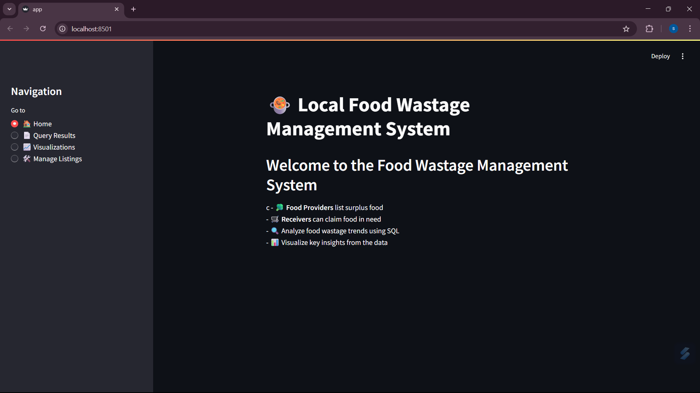
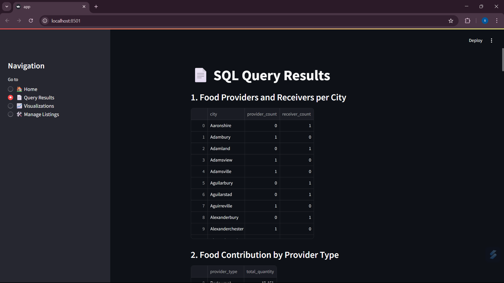
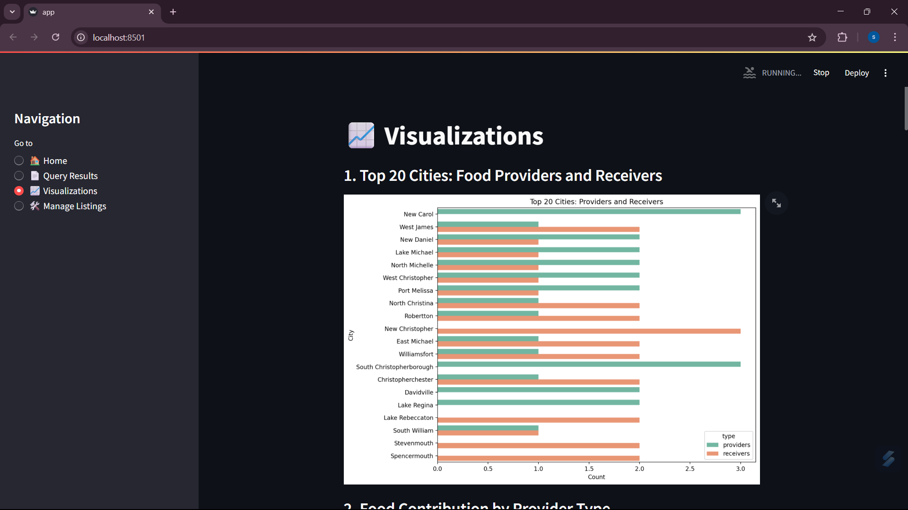
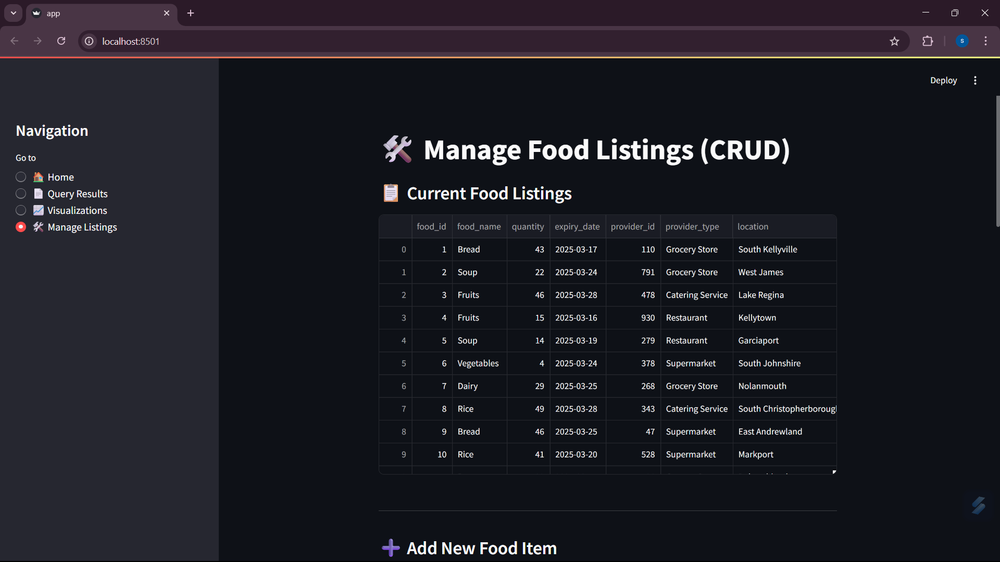

# 🍲 Local Food Wastage Management System

A Streamlit-based web application that helps reduce **food waste** by connecting surplus **food providers** (restaurants, grocery stores, etc.) with **receivers** (NGOs, community centers, individuals).

> Built as a capstone project under GUVI’s Python & Data Analysis track.

---

## 🔧 Tech Stack
- 🐍 Python
- 🛢️ SQL (PostgreSQL)
- 📊 Pandas, Matplotlib, Seaborn, Plotly
- 🌐 Streamlit (Web Interface)
- 📁 SQLAlchemy (DB connection)

---

## 📌 Features

| Module | Description |
|--------|-------------|
| 📄 SQL Query Results | 15+ complex SQL queries executed and displayed |
| 📈 Visualizations | Interactive charts for trends and insights |
| 🛠️ CRUD Operations | Add, Update, Delete food listings |
| 🔍 Filters | By city, provider type, food type, meal type |
| 📞 Contact Info | See provider contact by city |
| 📋 Real-time Data | All queries run on live PostgreSQL DB |

---

## 📷 Screenshots

### 🏠 Home Page


### 📄 SQL Query Results


### 📈 Visualizations


### 🛠️ Manage Listings (CRUD)


> *(Add these images to an `/images` folder in your repo)*

---

## 🚀 How to Run the App Locally

1. Clone the repository:
   ```bash
   git clone https://github.com/sampurna0121/Local-Food-Wastage-Management-System.git
   cd Local-Food-Wastage-Management-System
